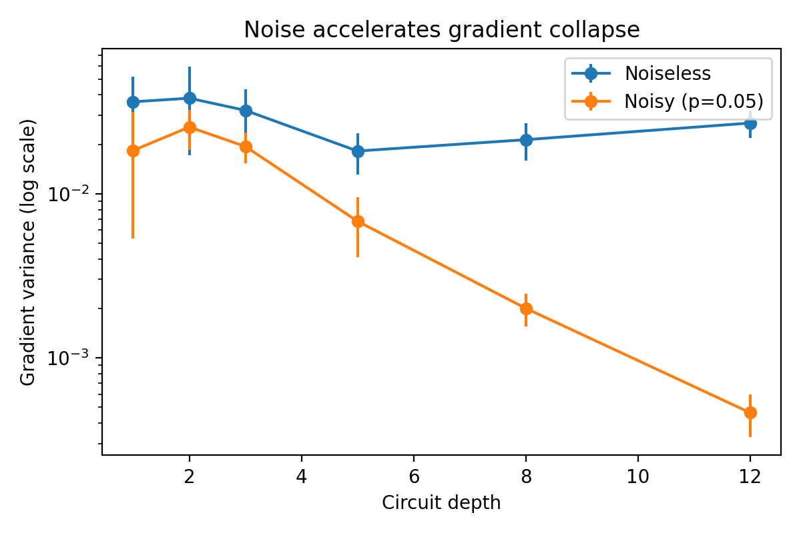
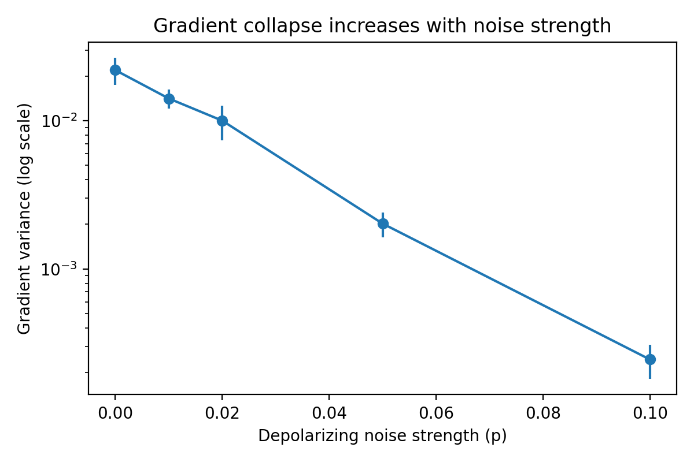

# Noise-Induced Trainability Transitions in Variational Quantum Neural Networks

## Overview

This project investigates how realistic noise in near-term (NISQ) quantum devices
affects the trainability of variational quantum neural networks (QNNs).

We study gradient statistics (variance and norm) as a function of circuit depth,
and show that noise significantly accelerates gradient collapse compared to the
noiseless baseline, even at small system sizes.

## Motivation

While variational quantum models have shown promise for learning tasks, their trainability is severely limited in practice.
This work focuses on understanding how intrinsic optimization barriers interact with extrinsic noise present in NISQ devices.

## Status

Status: Results complete (open to extensions)

## Planned Directions

- Analysis of barren plateaus in noiseless vs noisy regimes
- Study of gradient variance scaling with circuit depth
- Investigation of noise-induced phase transitions in trainability

## Limitations

This project uses classical simulation of quantum circuits and does not target near-term hardware deployment.

## Noise-Induced Gradient Collapse

We perform depth sweeps of variational circuits and compute gradient variance
using the parameter-shift rule. Results are averaged over 10 random initializations.

The figure below compares noiseless circuits to circuits with depolarizing noise
(p = 0.05). Gradient variance is plotted on a logarithmic scale.



**Observation.**
While noiseless circuits exhibit fluctuating but relatively stable gradient variance
at this system size, the presence of noise leads to a rapid, approximately exponential
suppression of gradients with depth.

This indicates that noise can induce barren-plateau-like behavior at significantly
shallower depths, limiting the effective trainability of deep variational circuits
on NISQ devices.

## Robustness to Noise Strength

To test whether the observed gradient collapse is sensitive to a specific noise level,
we perform a sweep over depolarizing noise strengths at fixed circuit depth (depth = 8),
averaging gradient variance over 10 random initializations.



**Observation.**
Gradient variance decreases monotonically as noise strength increases, indicating that
noise-induced gradient suppression is not a fine-tuned effect but a robust phenomenon
that worsens continuously with increasing device noise.

## Reproducing the Results

To reproduce the main figure:

```bash
conda activate qml
python experiments/depth_sweep_noiseless_avg.py
python experiments/depth_sweep_noisy_avg.py
python experiments/plot_gradients.py


